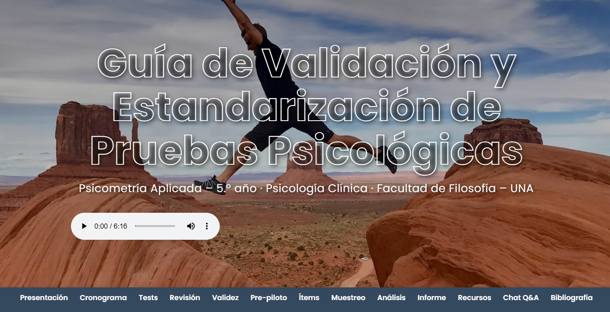

# Guía de Validación de Pruebas Psicológicas
### Plataforma Interactiva de Apoyo Académico



Bienvenido a la Guía Interactiva para la Validación y Estandarización de Pruebas Psicológicas, un proyecto diseñado como soporte académico para el curso de **Psicometría Aplicada** de la carrera de Psicología Clínica en la Facultad de Filosofía – UNA.

Este repositorio contiene todo el código fuente de la plataforma web.

**➡️ Visita la página en vivo:** <https://emorito.github.io/guia_psicometria/>

---

## ✨ Propósito y Visión

Lo que comenzó como una guía de recursos estática ha evolucionado hasta convertirse en una **plataforma de aprendizaje viva**. El objetivo principal es trascender los documentos pasivos y ofrecer a los estudiantes una herramienta de trabajo activa, moderna y atractiva que facilite el complejo proceso de validación de un instrumento psicométrico.

Esta plataforma está diseñada para:
- **Guiar** a los equipos a través de cada fase del proceso de validación.
- **Centralizar** todos los recursos necesarios (plantillas, guías, enlaces).
- **Reforzar** el aprendizaje mediante herramientas interactivas como quizzes y checklists.
- **Resolver** dudas frecuentes de manera instantánea a través de un asistente de Q&A.

---

## 🚀 Características Principales

Esta plataforma no es solo una página web, es un conjunto de herramientas integradas:

*   **Banner de Presentación Inmersivo:** Una bienvenida visualmente impactante con audio introductorio.
*   **Navegación Fija y Minimalista:** Un menú siempre accesible que permite un desplazamiento rápido entre secciones.
*   **Guía Interactiva de Jamovi:** Una ventana modal con una guía práctica y enlaces a tutoriales para el análisis de datos.
*   **Asistente de Investigación IA (NotebookLM):** Integración con un entorno de IA para que los estudiantes puedan "chatear" con las fuentes y profundizar en los conceptos.
*   **Mini-Chat Q&A:** Un sistema de respuesta rápida para resolver las dudas más comunes sobre conceptos y decisiones operativas, cargando las respuestas desde archivos JSON.
*   **Quizzes Interactivos por Sección:** Cuestionarios de 5 preguntas aleatorias al final de cada fase para autoevaluar la comprensión.
*   **Checklists de Progreso:** Listas de verificación interactivas en cada sección para que los equipos puedan monitorear sus avances.
*   **Centro de Recursos Centralizado:** Todos los documentos descargables (plantillas, rúbricas) con nombres amigables y un diseño coherente.
*   **Diseño Totalmente Responsivo:** Una experiencia de usuario impecable tanto en dispositivos de escritorio como en móviles.

---

## 🛠️ Stack Tecnológico

Este proyecto fue construido desde cero utilizando tecnologías web fundamentales, enfocándose en la eficiencia y la mantenibilidad sin depender de frameworks complejos de JavaScript.

*   **HTML5:** Para la estructura semántica del contenido.
*   **CSS3:** Para todo el diseño visual, utilizando prácticas modernas como:
    *   Variables CSS (`:root`) para una paleta de colores consistente.
    *   Flexbox y Grid para layouts complejos y responsivos.
    *   Animaciones y transiciones sutiles para una mejor experiencia de usuario.
    *   **Tailwind CSS (vía CDN):** Utilizado para estilizar rápidamente las tarjetas de los tests sugeridos.
*   **JavaScript (ES6+):**
    *   **Vanilla JS:** Todo el código de interactividad es JavaScript puro, sin librerías externas.
    *   **Manejo Asíncrono (`async/await`)** con la API `Fetch` para cargar dinámicamente el contenido de los quizzes y el chat desde archivos `.json`.
    *   Manipulación del DOM para renderizar componentes dinámicos como los quizzes, checklists y descargables.

---

## 📂 Estructura del Proyecto

El repositorio está organizado de la siguiente manera para facilitar su comprensión y mantenimiento:

```text
/
├── 📄 index.html
├── 📄 README.md
├── 📁 css/
│   └── 📄 styles.css
├── 📁 js/
│   ├── 📄 chat.js
│   ├── 📄 quizzes.js
│   ├── 📄 render-page.js
│   └── 📄 utils.js
├── 📁 data/
│   ├── 📄 qa_conceptos.json
│   ├── 📄 qa_decisiones.json
│   └── 📄 quiz_*.json
├── 📁 media/
│   ├── 🖼️ banner-bg.jpg
│   ├── 🎵 *.mp3
│   └── 🖼️ *.svg
└── 📁 docs/
    └── 📄 *.docx / *.pdf
```
---

## 📄 Licencia

Este proyecto se distribuye bajo la Licencia MIT. Consulta el archivo [LICENSE](LICENSE) para más detalles.

---
*Elaborado por Enrique Morosini con la asistencia de IA (Gemini de Google). Un proyecto que demuestra la increíble sinergia entre la visión humana y la capacidad de la inteligencia artificial para acelerar el desarrollo y refinar el diseño.*
